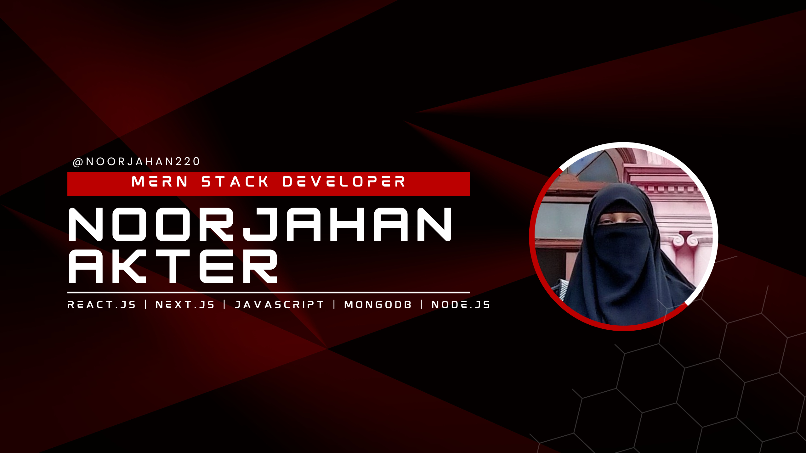

<!--- banner --->

  

 

  

 

<!--- about --->
- 🔭 I’m currently working on **a Full-stack e-commerce platform using React and Node.js**
- 🌱 I’m currently learning **TypeScript and MongoDB Optimization**
- 👯 I’m looking to collaborate on **Open-source MERN stack projects and React libraries**
- 💬 Ask me about **React.js, Next.js, Node.js, Express, and Database Design**
- 🧩 Fun fact: **I treat bugs like puzzles waiting to be solved**
- 📍 Based in **Jessore, Bangladesh**
- 📫 Reach me at **[noorjahanmeem220@gmail.com](mailto:noorjahanmeem220@gmail.com)**

 

<!--- socials --->
## <b> FOLLOW ME ON SOCIALS:</b>

  

    <!-- LinkedIn -->
    
    <!-- Email -->
    
    <!-- Facebook (Optional - kept per request) -->
    
  

 

<!--- technology --->
##  <b> TECHNOLOGY STACK:</b>

### Frontend & Languages:

### Backend & Database:

### Tools & Design:

 

<!--- statistics --->
## <b> GITHUB STATISTICS & ANALYSIS:</b>

### GitHub Statistics:
|  |  |
| :---: | :---: |

### Streak & Contributions:
|  |  |
| :---: | :---: |

 

<!--- random quote --->
##  <b> RANDOM DEV QUOTE:</b>
